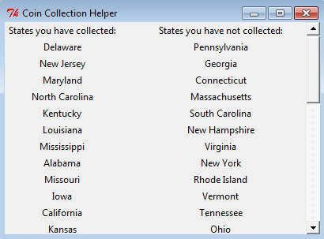

# Capstone Project 5

My project is a built-out version of the Coin Collector Lab. I used Tkinter to create a standalone app which displays a grid of state names, the image of the state's coin, and a checkbox denoting whether or not the user has collected that coin. At the top of the window is a map with all the states the user has collected colored in. Example:

This map is also a button, when the user clicks on it a new window pops up with a list of states collected and uncollected. Example:

Each state's coin is yet another button, which also opens a new window showing a description of the image on the coin, when the coin was first released, and a map with just that state colored in. Example:

<h2>Setup</h2>

The maps are created using matplotlib and basemap, which unfortunately doesn't work with python 3. You'll have to run the program using a python 2.7 environment, which I accomplished using Pycharm's Project Interpreter setting coupled with Miniconda3(see image below, highlighted is the Miniconda3 interpreter and project requirements from requirements.txt). I haven't personally tested this, but if you set the Python 2.7 environment and then download requirements.txt, you should be good to go. Python 3 won't be able to install basemap due to their incompatibility, so it is important you do it in that order.

To start the program, just run gui.py. There are several coins already marked as collected so you can see the app in-action immediately. Happy coin collecting!
